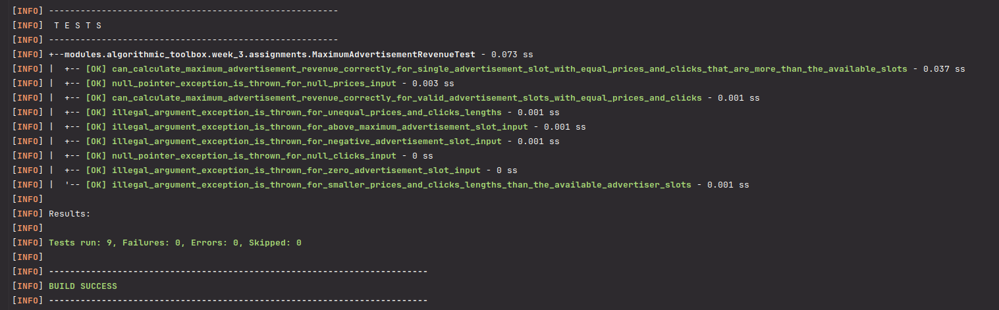

# Data Structures and Algorithms Specialization

 **Offered By:** [*UC San Diego, California* ](https://ucsd.edu/)  and [*Coursera*](https://www.coursera.org/)

  
In this specialization, I focus on understanding algorithms and data structures to improve my knowledge of computer science. 

## Courses

 - Algorithmic Toolbox
 - Data Structures
 - Algorithms on Graphs 
 - Algorithms on Strings 
 - Advanced Algorithms and Complexity 
 - Genome Assebly Programming Challenge

## [Course #01: Algorithmic Toolbox](Algorithmic%20Toolbox)

*This course covers basic algorithmic techniques and ideas for computational problems arising frequently in practical applications: sorting and searching, divide and conquer, greedy algorithms, dynamic programming.*

### There are 6 modules in this course: 

 - Programming Challanges
 - Algorithmic Warm-up
 - Greedy Algorithms
 - Divide-and-Conquer
 - Dynamic Programming 1
 - Dynamic Programming 2

## Running Tests with Maven 🧪
*This project uses JUnit Jupiter (JUnit 5) for unit testing. To run the tests, follow these steps:*

1.**Prerequisites**:
-   **JDK 19** installed.
-   **Maven** installed.

2.**Run Tests**:
-   Navigate to the project root directory (where `pom.xml` is located).
-   Execute `mvn clean test` in the terminal.

***Note***: *The Maven Surefire Plugin is configured with a `maven-surefire-junit5-tree-reporter` to provide a tree structure execution representation. This format helps in understanding the hierarchy and outcome of the tests.*

*Example output*

For detailed HTML reports, run `mvn surefire-report:report`. The report is generated at `target/site/surefire-report.html`.